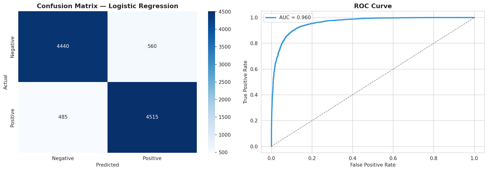
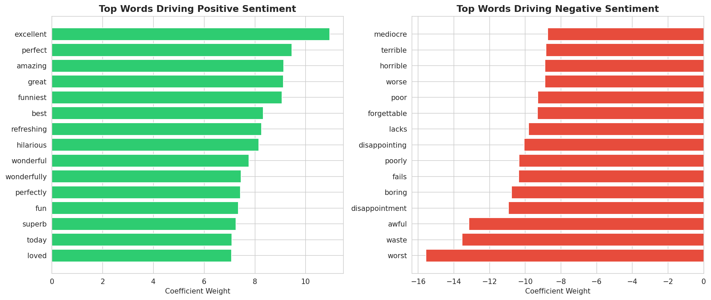

# Sentiment Analysis — IMDB Movie Reviews

Classifies movie reviews as positive or negative using NLP, achieving 
90% accuracy and 0.960 ROC-AUC with balanced precision and recall.

## Problem
Businesses need to understand customer sentiment at scale — from product 
reviews to social media — faster than manual reading allows.

## Approach
- Text cleaning: HTML tag removal, punctuation stripping, lowercasing
- TF-IDF vectorization with unigrams and bigrams (15,000 features)
- Compared Logistic Regression vs Naive Bayes
- Full evaluation: accuracy, F1, ROC-AUC, confusion matrix
- Interpretability analysis — identified the words most predictive of 
  positive/negative sentiment

## Results

**Logistic Regression (best model):**
- Accuracy: 90%
- Precision/Recall: 0.89–0.90 (balanced across both classes)
- ROC-AUC: 0.960

**Interpretability:** extracted the strongest positive and negative 
sentiment indicator words/phrases directly from model coefficients — 
useful for explaining predictions to non-technical stakeholders.

## Tech Stack
Python · Scikit-learn · TF-IDF · Pandas · NumPy

## Try It
View the full notebook on [Kaggle](https://www.kaggle.com/code/aseermuntaqueemarko/sentiment-analysis-nlp-with-tf-idf) 
or open `notebook.ipynb` here in Jupyter/Colab.

Dataset: [IMDB Dataset of 50K Movie Reviews (Kaggle)](https://www.kaggle.com/datasets/lakshmi25npathi/imdb-dataset-of-50k-movie-reviews)
